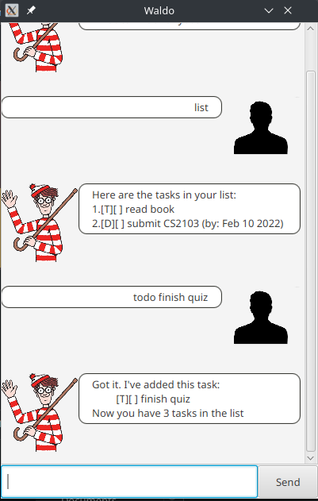
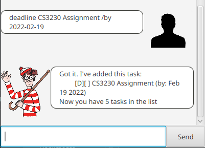
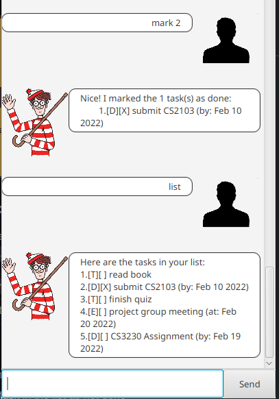
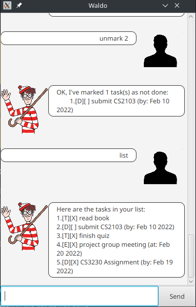
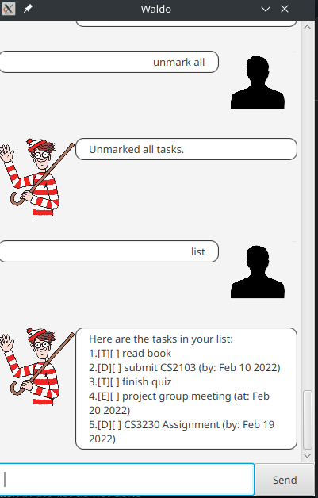

# User Guide

Waldo is a personal assistant chatbot that allows users to track upcoming deadlines, tasks and events in an organised manner.

# Key Features

## Task Tracking

Too many tasks and deadlines to track? No worries! You can tell Waldo all the tasks and he can remember it for you. Furthermore, you can even tell Waldo when you completed a task and he will remember it for you.

## Mass Ops

Tired of typing the same command over and over again? Fret not! You can specify a range of indexes or even say 'all'!

## Search by Keyword

Finding your tasks shouldn't be like finding Waldo. You can give Waldo a keyword and he will go look for tasks that matches that keyword!

# Usage

## Date Formatting

For all commands that require a date, the format must be as follows `yyyy-mm-dd`.

Example: `2022-02-14`

## Commands

### Exit - `bye`

Closes the application.

### List all tasks - `list`

Shows a list of all the tasks that Waldo is keeping track of. Within each entry, it would store the task type, title,
completion status (done/undone) and date (if applicable).

Syntax: `list`

### Add a todo task - `todo`

Creates a todo task to the task list.

Syntax: `todo TASK`

-   `TASK` should not be empty

Example: `todo finish quiz`

### Add an event task - `event`

Creates an event task to the task list.

Syntax: `event EVENT /at DATE`

-   `EVENT` and `DATE` should not be empty.
-   If there is a task that falls on the same day as the given `DATE`. The task will not be added.

Example: `event project group meeting /at 2022-02-20`

### Add a deadline task - `deadline`

Creates a deadline task to the task list.

Syntax: `deadline DEADLINE /at DATE`

-   `DEADLINE` and `DATE` should not be empty.
-   If there is a task that falls on the same day as the given `DATE`. The task will not be added.

Example: `deadline CS3230 Assignment /at 2022-02-19`

### Delete a task - `delete`

Deletes a set of tasks from the given indexes. If the user wishes to delete all tasks in the list, the user
should supply the `all` parameter.

Syntax: `delete INDEX [OTHER_INDEX]`

-   The user must supply at least `INDEX` or `all`.
-   `INDEX` and `OTHER_INDEX` should not be negative integers.

Example: `delete 2`, `delete 2 3 5 7`, `delete all`

Picture here.

### Mark a task - `mark`

Marks a task as completed from the given indexes. If the user wishes to mark all tasks as completed, the user should
supply the `all` parameter

Syntax: `mark INDEX [OTHER_INDEX]`

-   The user must supply at least `INDEX` or `all`.
-   `INDEX` and `OTHER_INDEX` should not be negative integers.

Example: `mark 2`, `mark 2 3 5`, `mark all`

Marking a single item

Marking all items

### Unmark a task - `unmark`

Marks a task as not completed from the given indexes. If the user wishes to mark all tasks as completed, the user
should supply the `all` parameter

Syntax: `unmark INDEX [OTHER_INDEX]`

-   The user must supply at least `INDEX` or `all`.
-   `INDEX` and `OTHER_INDEX` should not be negative integers.

Example: `unmark 2`, `unmark 2 3 5`, `unmark all`

Unmarking a single item

Unmarking all items

### Finding a task - `find`

Finds a task using the given keywords.

Syntax: `find KEYWORD [OTHER_KEYWORDS]`

-   `KEYWORD` must not be empty
-   The order of the keywords does not matter `assignment quiz` will have the same results as `quiz assignment`.
-   The keywords searched is case-insensitive `assignment` and `assiGnmenT` will return the same results

Picture here.
